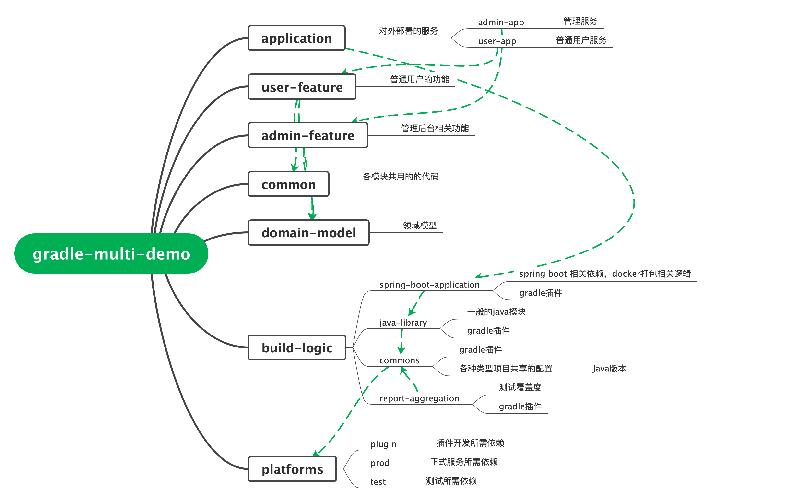

# 多项目管理demo

## 快速开始
* 启动服务端：
```bash
./gradlew :application:admin-app:bootRun
```
* 启动客户端：
```bash
./gradlew :application:user-app:run
```

## 模块说明


## 依赖包管理
* 定义 gradle/libs.versions.toml
  * [versions] 版本号
  * [libraries] 依赖包
  * [bundles] 一组依赖
* 引用 build.gradle
  * libs.okhttp：libs. 是统一前缀，okhttp对应定义中[libraries].okhttp

## 已知问题
1. 本地使用gradle wrapper方式无法启动服务，解决办法是手动下载对应版本的 gradle，并设置 IDEA 使用该 gradle
1. mybatis 报错：`org.apache.ibatis.binding.BindingException: Invalid bound statement (not found)`，原因是在 Idea 中启动服务时，默认对子模块使用 compileJava 命令，没有拷贝 resource 文件到 build 目录，导致找不到 Mapper 对应的 xml 文件，解决办法是在新增、编辑xml文件后，手动对模块执行 gradle 的 classes 命令

# 测试覆盖率
参考 user-feature/user-app1 的 build.gradle，plugins增加`id('demo.report-aggregation')`，然后执行命令`./gradlew :user-feature:user-app1:codeCoverageReport`，打开user-feature/user-app/build/reports/tests/test/index.html 即可查看报告

## 参考资料
* [Structuring Software Products: gradle-sample](https://docs.gradle.org/current/userguide/structuring_software_products.html)